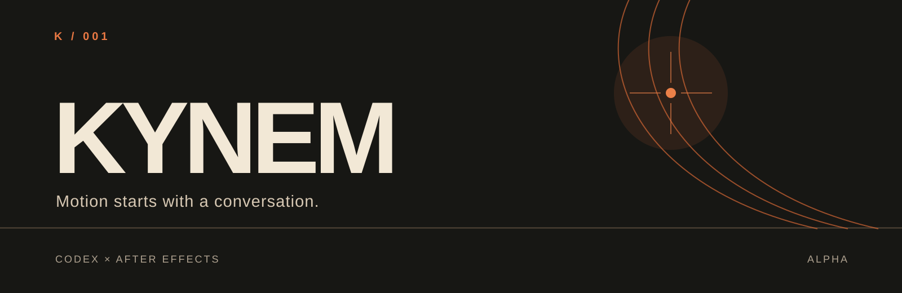

# KYNEM

**Make a precise After Effects edit from a Codex conversation.** KYNEM connects Codex to After Effects on your Mac so you can inspect a composition, ask for a scoped change, and review rendered frames. It works on a **copy of a saved `.aep`**; there is no separate panel or chat app.

**[Download KYNEM for Mac (ZIP)](https://github.com/AndreXes03/ae-agent-lab-alpha/releases/download/v0.1.0-alpha.3-studio.2/KYNEM-Mac-0.1.0-alpha.3-studio.2.zip)** · [Installation guide in Italian](docs/INSTALL.it.md) · [Report what you tried](https://github.com/AndreXes03/ae-agent-lab-alpha/issues/new/choose)

> **Experimental alpha.** The native edit and render evidence comes from one Mac running After Effects 2026 (26.5). The new installer and Codex plugin have offline checks; the complete `@KYNEM` workflow on another Mac still needs tester validation.

## See the work


This is a **native After Effects render**, not an interface mockup. Explore the [motion preview](demo/warm-glow/heavy-grain-preview.mp4) and the included [editable project](demo/warm-glow-heavy-grain.aep). The recorded native test inspected the project, retimed an Exposure pulse, read the changed keyframes back, and rendered review frames on the tested Mac. [See the exact example](docs/EXAMPLE-PROMPTS.md).

## Try it on your Mac

1. Install and open **Codex desktop** and **After Effects 2026**. In AE, enable **Preferences → Scripting & Expressions → Allow Scripts to Write Files and Access Network**.
2. Download the **KYNEM-Mac ZIP** above, extract it, and double-click `Install KYNEM.command`. macOS may ask you to approve the unsigned launcher and AE automation. If Node.js is missing, installation downloads a private runtime and requires internet.
3. Open a new Codex chat. Select **KYNEM** from `@` (or use `$kynem` if the menu has not refreshed). Give it a saved `.aep` and ask for one specific edit. Inspect the copied project and rendered result before using the change.

The installer includes the compiled bridge and dependencies; recipients do not need to run npm or configure MCP manually. See the [Italian step-by-step guide](docs/INSTALL.it.md) for setup, permissions, and troubleshooting. Linked footage, fonts, and third-party plugins must already be available on the Mac where you try a project.

### What could I ask?

These are **example requests**, not claims that every workflow has been tested end to end:

> “In a copy of this project, move the title’s entrance eight frames later. Leave everything else as it is, then render before and after frames for me to compare.”

> “Inspect the main composition and tell me which layers create the glow. Render a few frames and flag any clipping or hard-to-read text. Don’t edit the project.”

> “On a copied project, soften only the existing glow blur. Read the value before and after, save a new variant, and show me both rendered frames.”

KYNEM is intended for **small, reviewable changes**. Ask it to confirm the active project and layers before editing, save a variant, read changed values back, and inspect actual renders. If a call times out, inspect the state before retrying because an edit may already have run.

## Help shape the alpha

Try the included demo or a disposable copy of your own work, then [tell us what worked and what to improve](https://github.com/AndreXes03/ae-agent-lab-alpha/issues/new/choose). A short description of your Mac, AE version, prompt, and observed result helps. Please redact private paths and client details; there is no need to upload a client project.

<details>
<summary>Developer setup and source demo</summary>

Current `main` also includes [efficient workflow guidance](docs/EFFICIENT-WORKFLOWS.md), selective operation lookup and an offline retiming planner. These changes are newer than the linked installer and have offline verification only.

The source route requires macOS, After Effects 2026, [Node.js 24+](https://nodejs.org/en/download), and a configured Codex CLI. Use the [source release](https://github.com/AndreXes03/ae-agent-lab-alpha/releases/tag/v0.1.0-alpha.3-studio.2), keep it in a stable folder, and double-click `Start Demo.command`. It installs locked dependencies, builds the MCP server, and starts a named AE worker with a fresh copy of the bundled project. Keep its Terminal window open and paste the session prompt into a new Codex chat. Finish with `Stop Demo.command`.

```bash
npm ci --ignore-scripts
npm run build
npm run connect:codex
npm run demo:start
npm run demo:status
npm run demo:stop
```

See [source quickstart](docs/ALPHA-QUICKSTART.md), [session guide](docs/DEMO-SESSION.md), [tool catalog](docs/TOOLS.md), and [uninstall](docs/UNINSTALL.md). The earlier [v0.1.0-alpha.2 release](https://github.com/AndreXes03/ae-agent-lab-alpha/releases/tag/v0.1.0-alpha.2) remains available.

</details>

KYNEM is an independent experiment derived from the MIT-licensed [kumo.productions MCP After Effects project](https://github.com/kumoproductions/mcp-aftereffects). Original copyright and license notices are retained in [LICENSE](LICENSE); see [provenance](PROVENANCE.md). It is not an official Adobe, OpenAI, or upstream product.
