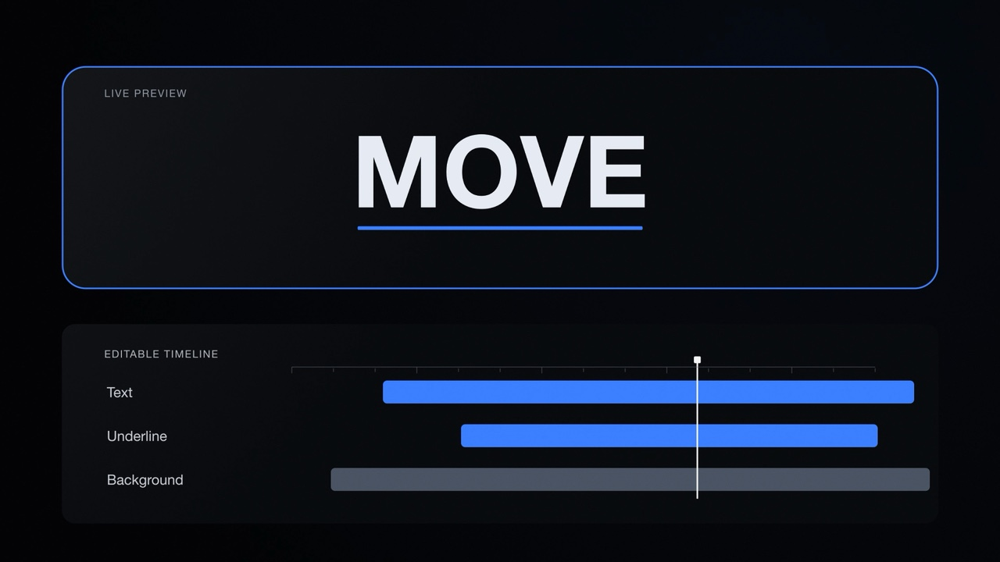

# KYNEM

**Code-defined motion. Editable After Effects layers.**

KYNEM connects Codex to native After Effects on your Mac. Inspect a project, batch a scoped edit, or revise a 2D scene description. Keep the text, shapes and keyframes editable in AE; work on a copy of your saved project.

Prompt → inspect → typed edit → native AE → review.

## Demo

[](https://github.com/AndreXes03/ae-agent-lab-alpha/releases/download/v0.1.0-alpha.6/KYNEM-README-demo-v18-clean.mp4)

[Watch/download the film](https://github.com/AndreXes03/ae-agent-lab-alpha/releases/download/v0.1.0-alpha.6/KYNEM-README-demo-v18-clean.mp4) · [What was verified](docs/DEMO.md)

An agent authored and revised native AE graphics with human art direction. The command cards and timeline are illustrative; this retimed promotional animation is not a live agent execution recording.

## What it does

- **Scoped edits:** inspect relevant targets, batch typed changes, checkpoint and read the results back.
- **Revisable scenes:** stable element IDs, explicit frame timing and property diffs support bounded 2D updates; conflict checks detect manual changes before an update can overwrite them.
- **Native output:** text, shapes, parenting, keyframes and supported effects stay editable in AE.
- **Contextual review:** comments bind to a video version, frame/range or storyboard revision. In a supported Codex browser, open the feedback in the native composer and submit it to the current chat.

Storyboard and review tools are experimental supporting workflows. Native annotation availability depends on the host browser; ordinary browsers retain the local inbox/export. Opening the composer does not confirm delivery or start work. [Scenes](docs/SCENE-WORKFLOW.md) · [Review](docs/LOCAL-REVIEW.md) · [Storyboard](docs/STORYBOARD.md)

**Best fits:** retime or restyle existing compositions, make text/layout variants, and build small UI/title animations.

## Prerequisites

Recorded native checks cover one Mac with **After Effects 2026 (26.5)**. Other versions, hosts and fresh-machine installation need separate validation.

- Codex desktop or a configured Codex CLI; After Effects 2026 installed.
- AE **Preferences → Scripting & Expressions → Allow Scripts to Write Files and Access Network** enabled.
- A saved `.aep` and its local footage, fonts and required third-party plugins.
- Node.js 24+ for the source route; the installer can download a private runtime.

macOS may request launcher and AE automation permissions. This is an experimental alpha; inspect the copied project and actual output before delivery.

## Quickstart

### Mac installer

[Download KYNEM alpha.6 for Mac](https://github.com/AndreXes03/ae-agent-lab-alpha/releases/download/v0.1.0-alpha.6/KYNEM-Mac-0.1.0-alpha.6.zip). Extract the whole ZIP and double-click **Install KYNEM.command**. It includes the compiled bridge and dependencies; downloading a missing Node runtime requires internet.

Open a new Codex chat, select **KYNEM** with `@` or invoke `$kynem`, and give it your saved project path plus one specific edit. The skill starts an isolated worker on a copied project. [Italian installation guide](docs/INSTALL.it.md).

### From source

Keep the checkout in a stable folder. From its root:

```sh
npm ci --ignore-scripts
npm run build
npm run connect:codex
npm run demo:start
npm run demo:status
```

Use the copied project path and prompt printed by the named demo session. Finish with `npm run demo:stop`. **Start Demo.command** and **Stop Demo.command** provide the same route. [Setup and diagnostics](docs/ALPHA-QUICKSTART.md).

## Reproduce a bounded task

The [MOVE fixture](examples/readme-move.json) describes a title and underline. With KYNEM active and a disposable saved project supplied, ask:

```text
On a managed copy of my saved project, build examples/readme-move.json
using the native scene workflow. Confirm the copy and installed font first.
Create native text and shape layers; preserve unrelated compositions.
Read the created layers and keyframes back, save the copy, and inspect
frames at 0.5 and 2 seconds. Report unsupported steps honestly.
```

This fixture is checked offline; native acceptance of its exact output remains to verify. It omits the promotional UI, transitions and glow. For a recorded existing-project edit, use the [Warm Glow Exposure retime](docs/EXAMPLE-PROMPTS.md).

## Limits

Readback verifies values; rendered frames verify appearance at those times; playback is needed to assess motion. Creative direction and acceptance stay with the user. Schematic previews and generated concepts do not establish native AE output.

The declarative scene schema covers bounded 2D graphics. Effects, masks, footage and other content may require separate typed operations discovered through the loaded catalog. Native nonlinear scene motion uses sampled keys with documented integer-frame limits. No performance benchmark or broad compatibility claim is made. [Validation and boundaries](docs/NATIVE-SCENES-VALIDATION.md).

After a timeout, inspect status and reuse the same request/job identity: an edit may already have run. Partial changes have recovery checkpoints, not automatic rollback. Keep the original project and managed-copy metadata.

## Architecture and data

A Codex plugin exposes a local MCP server, which sends typed operations to the named AE worker through the local bridge. Arbitrary evaluation is disabled in the documented workflow. Scene baselines support property diffs and conflict checks; preserve them with managed projects.

Copied projects, session files, checkpoints and review receipts remain local. Codex handles the conversation under your service settings; local AE execution does not make the conversation offline. Native feedback handoff uses the [official Browser Annotation API](https://learn.chatgpt.com/docs/annotations-extensibility) and requires user submission. [Agent workflow](docs/AGENT-WORKFLOW.md) · [Tool catalog](docs/TOOLS.md) · [Uninstall](docs/UNINSTALL.md).

## Contributing and license

[Report a reproducible issue](https://github.com/AndreXes03/ae-agent-lab-alpha/issues/new/choose) with your Mac/AE version, prompt and observed result. Redact private paths and client details. [Development checks](CONTRIBUTING.md).

MIT licensed. Derived from [kumoproductions/mcp-aftereffects](https://github.com/kumoproductions/mcp-aftereffects); original notices are retained in [LICENSE](LICENSE) and [PROVENANCE.md](PROVENANCE.md). Independent project; no Adobe, OpenAI or upstream endorsement.
