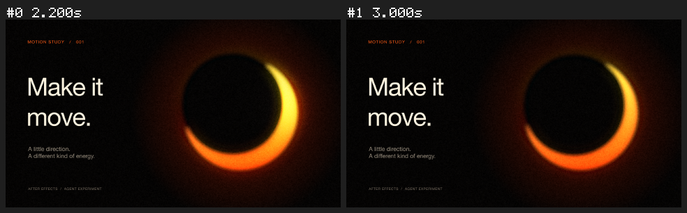

# Native Codex proof

In a recorded local tool-use session on AE 2026 (26.5), Codex inspected a disposable copy of the Warm Glow project, saved a variant, moved the Exposure peak from 1.8 to 2.2 seconds and its settle key from 2.6 to 3.0 seconds, read the keyframe values back and rendered frames at the two new times.

These are rendered results, not a screen recording. The full local session logs are not distributed. The bundled source project is `../warm-glow-heavy-grain.aep`; it is the input scene, not the edited proof variant. This result does not establish support for other AE versions or arbitrary client projects.
